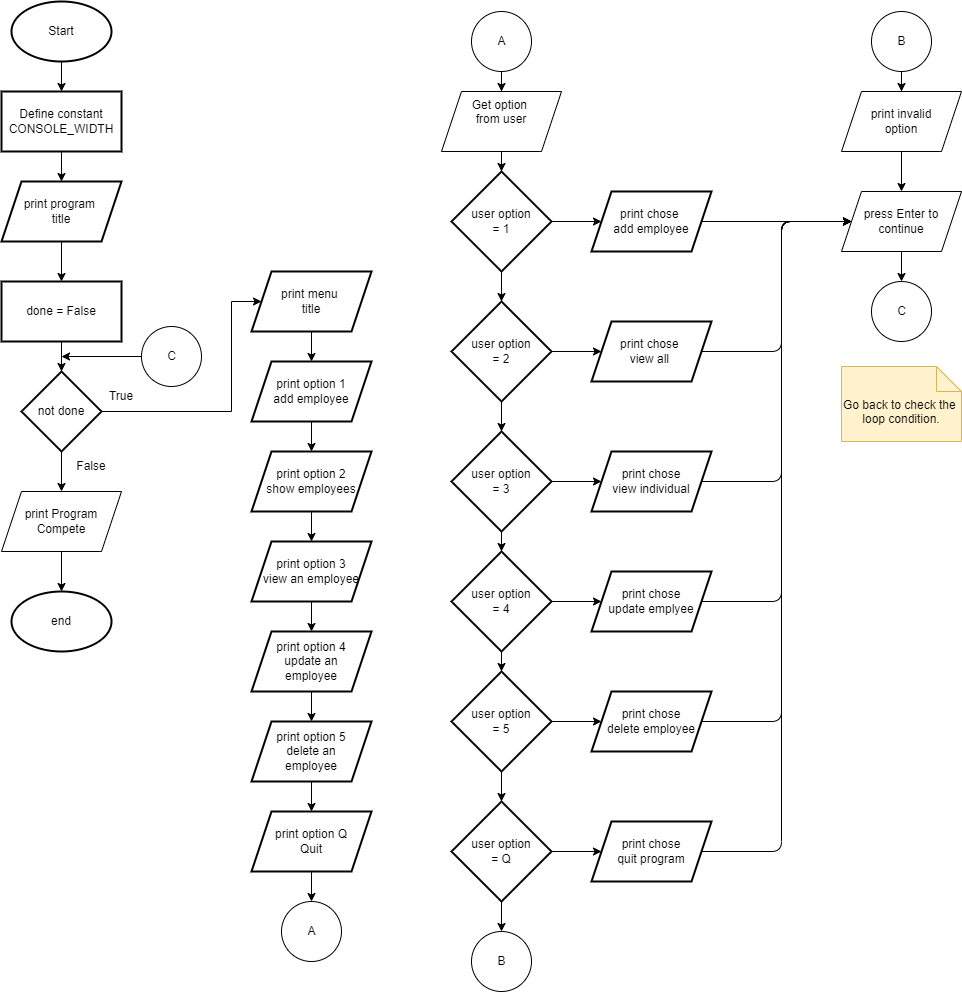
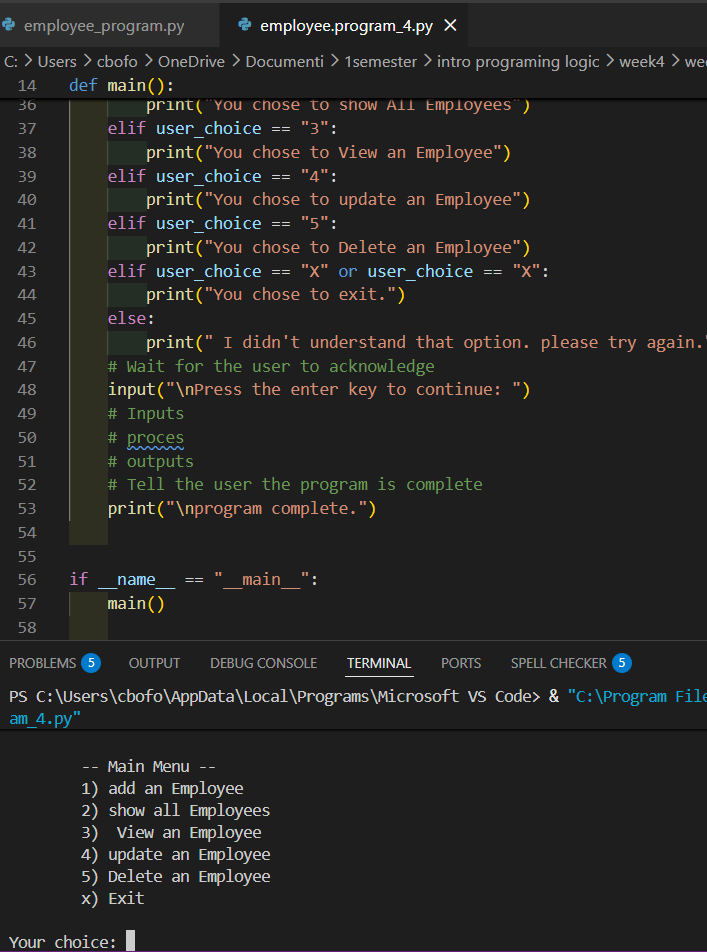
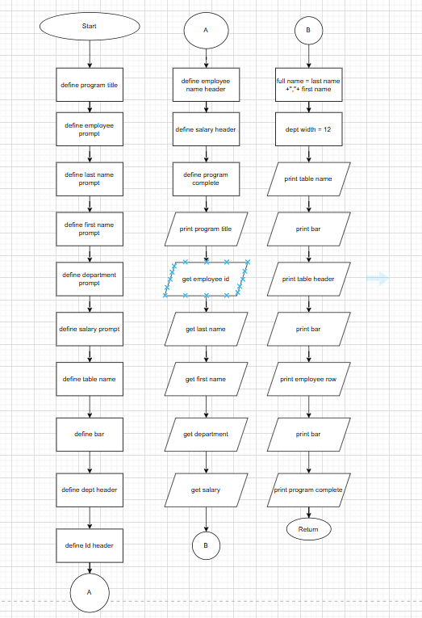
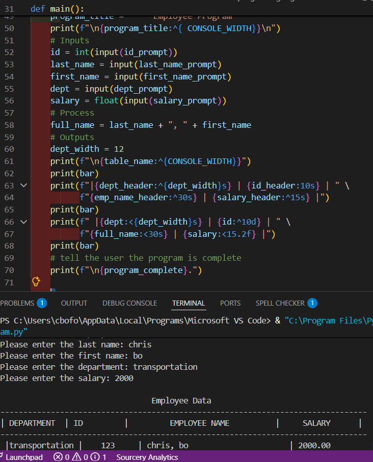

# THE FULL EMPLOYEE MANAGEMENT SYSTEM

# Employee-management-system-
An Employee Management System build with Python  that demonstrates the use of structured Programming, modular design, and problem-solving techniques. This command-line application allows users to manage employee records  through a simple, menu-driven  interface.   I developed this project step-by-step

# markdown

# Overview
The Employee Management System  is a python-based command-line application that allows user to manage employees record.

# This project is being developed step-by-step
- planning
- system design
- flowchart development
- programming
- testing
- documentation
  
The goal is to write clean, maintainable, and reusable Python code while flowing good programming practices.
# The first version of Employee Management System

# upcomming features
-Menu system
- Add Employee
- view all employees
- view individual employee
- update an employee
- delete an employee
- exit the program
  
# Author
Chris Bofole
Software Engineering Student 
